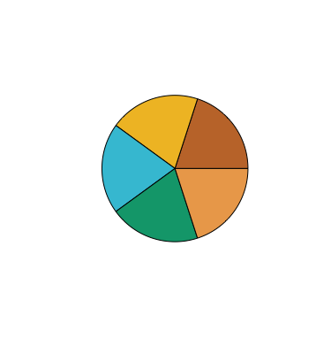
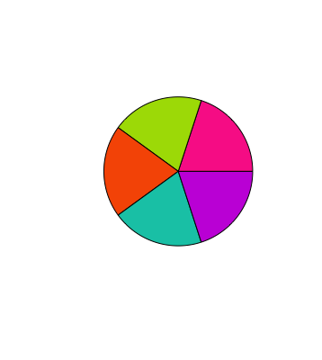
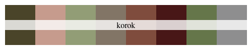
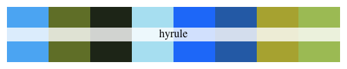

# joycon

> Color palettes inspired by Nintendo.

## Install package

``` r
install.packages("devtools")
devtools::install_github("jrcalabrese/joycon")
library(joycon)
library(scales)
```

## Color palettes

``` r
show_col(joycon_palettes$newhorizons, labels = FALSE)
```



``` r
show_col(joycon_palettes$splatoon, labels = FALSE)
```




``` r
show_col(joycon_palettes$korok, labels = FALSE)
```



``` r
show_col(joycon_palettes$hyrule, labels = FALSE)
```




