# joycon  

> Color palettes inspired by Nintendo.

## Install package

``` r
devtools::install_github("jrcalabrese/joycon")
library(joycon)
```

## Introduction

The **joycon** package provides over 40 color palettes inspired by Nintendo video games, including Super Mario, the Legend of Zelda, and Animal Crossing. 

I included a bunch of games, but if I missed one, feel free to DM me on Twitter `@jrosecalabrese` and I'll try to add it. 

Hexsticker created with [Emi Tanaka's PowerPoint template](https://emitanaka.org/posts/hexsticker/). 

## Color palettes

``` r
joycon_pal("NewHorizons")
```

<p float="left">
  
  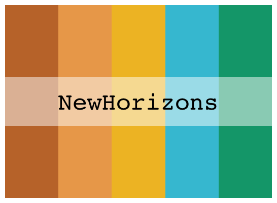 
</p>

``` r
joycon_pal("Hyrule")
```

<p float="left">
   
  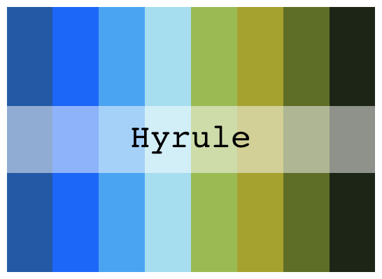 
</p>

``` r
joycon_pal("Splatoon")
joycon_pal("WiiFit")
joycon_pal("Nintendogs")
```

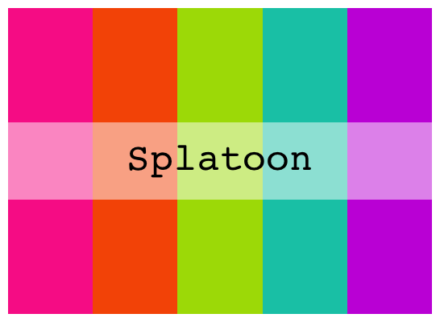 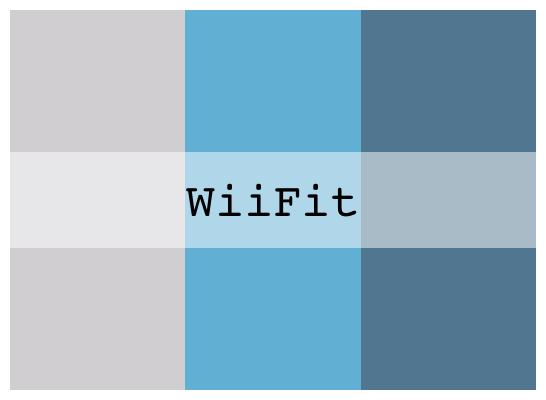 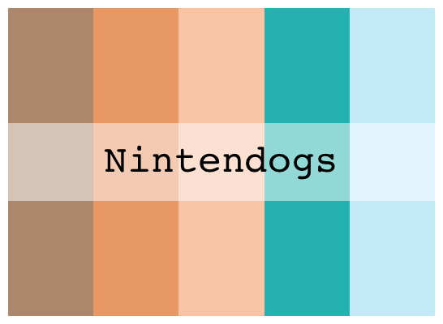 

``` r
joycon_pal("TwilightPrincess")
joycon_pal("Xenoblade")
joycon_pal("KidIcarus")
```

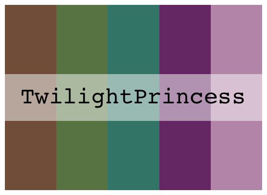 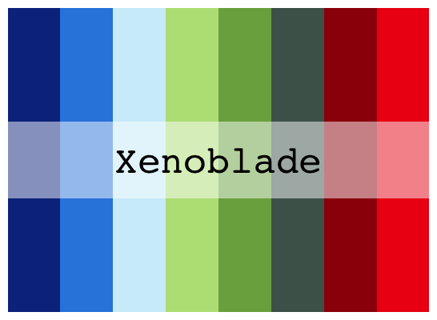 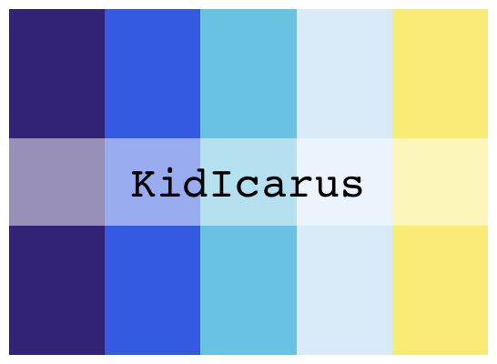 

## Example visualizations

``` r
library(ggplot2)
ggplot(diamonds, aes(x = cut, y = price, fill = cut)) + 
  geom_boxplot() + 
  scale_y_log10() + 
  scale_fill_manual(values = joycon_pal("Isabelle")) +
  ggtitle("Isabelle palette")
```

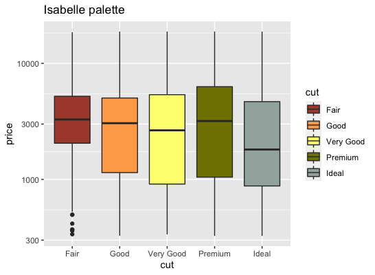

``` r 
ggplot(diamonds, aes(x = cut, fill = cut)) + 
  geom_bar(stat = "count") +
  scale_fill_manual(values = joycon_pal(name = "SkywardSword") +
  ggtitle("Skyward Sword palette")
```

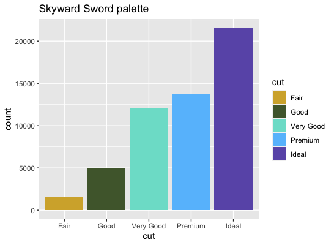

``` r
ggplot(iris, aes(x = Sepal.Length, y = Sepal.Width))+
  geom_point(aes(color = Sepal.Length), size = 5) + 
  scale_color_gradientn(colors = joycon_pal("AceAttorney", type = "continuous")) +
  ggtitle("Ace Attorney palette") +
  labs(caption = "(Yes, I know Ace Attorney is developed by Capcom)")
```

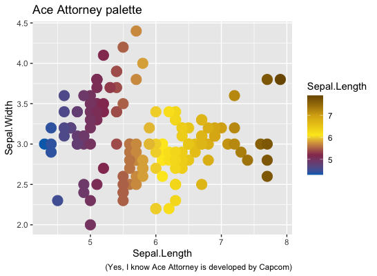
