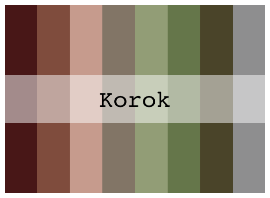
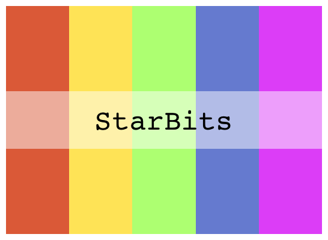

# joycon: Color palettes inspired by Nintendo

> Color palettes inspired by Nintendo.


Hex sticker created with [Emi Tanaka's PowerPoint template](https://emitanaka.org/posts/hexsticker/). 

## Install package

``` r
install.packages("devtools")
devtools::install_github("jrcalabrese/joycon")
library(joycon)
```

## Color palettes

``` r
pie(rep(1, 5), col = joycon_palettes$NewHorizons, labels = NA)
```

<p img="middle">
 
 
</p>

``` r
pie(rep(1, 8), col = joycon_palettes$Hyrule, labels = NA)
```

<p img="middle">
 
 
</p>

``` r
pie(rep(1, 5), col = joycon_palettes$Splatoon, labels = NA)
pie(rep(1, 8), col = joycon_palettes$Korok, labels = NA)
pie(rep(1, 5), col = joycon_palettes$StarBits, labels = NA)
```

   

## Example visualizations

``` r
library(ggplot2)
ggplot(mtcars, aes(x = mpg)) +
  geom_density(aes(fill = factor(gear)), alpha=0.8) +
  scale_fill_manual(values = joycon_pal("Splatoon")) +
  ggtitle(("Splatoon palette"))
```


``` r 
ggplot(iris, aes(x = Sepal.Length, fill = Species)) + 
  geom_histogram(bins = 30) +
  scale_fill_manual(values = joycon_pal(name = "SkywardSword")) +
  ggtitle("Skyward Sword palette")
```


