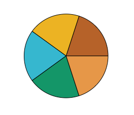
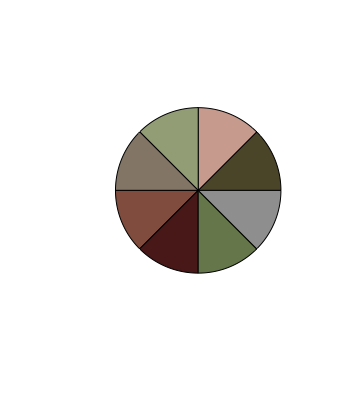

# joycon

> Color palettes inspired by Nintendo.

## Install package

``` r
install.packages("devtools")
devtools::install_github("jrcalabrese/joycon")
library(joycon)
```

## Color palettes

``` r
joycon_pal("newhorizons")
```



``` r
joycon_pal("splatoon")
```


``` r
joycon_pal("isabelle")
```


``` r
joycon_pal("korok")
```



``` r
joycon_pal("hyrule")
```


